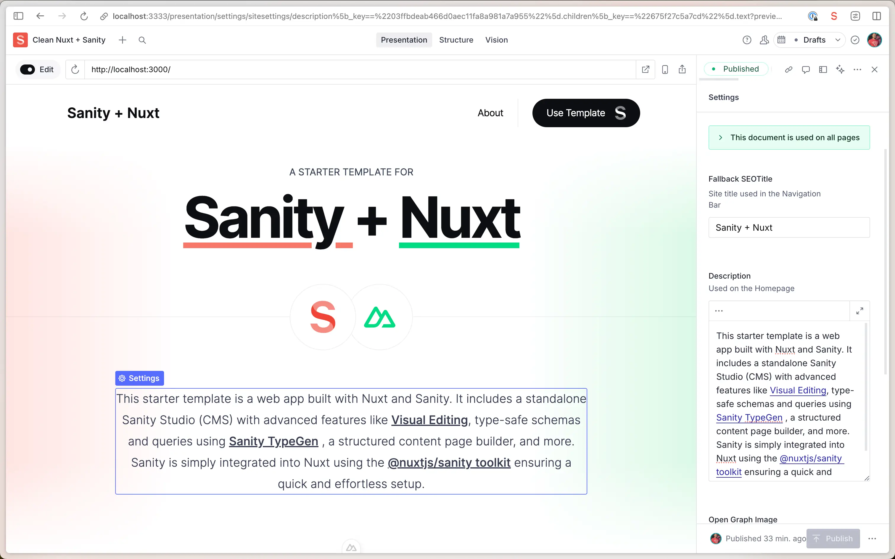

# Clean Nuxt + Sanity app

This template includes a [Nuxt](https://nuxt.com/) app with a [Sanity Studio](https://www.sanity.io/) – an open-source Vue application that connects to your Sanity project's hosted dataset. The Studio is configured locally and can then be deployed for content collaboration.



## Features

- **Nuxt 3 for Performance:** Leverage the power of Nuxt 3's hybrid rendering capabilities for blazing-fast performance and SEO-friendly applications.
- **Real-time Previews:** Edit content live with Sanity's [Presentation Tool](https://www.sanity.io/docs/presentation) and see updates in real time.
- **Powerful Content Management:** Collaborate with team members in real-time, with fine-grained revision history.
- **AI-powered Media Support:** Auto-generate alt text with [Sanity AI Assist](https://www.sanity.io/ai-assist). (Available on Free Trial and Growth Tiers. [See Pricing](https://www.sanity.io/pricing))
- **Flexible Rendering Strategies:** Choose between Server-Side Rendering (SSR), Static Site Generation (SSG), or hybrid rendering at the route level.
- **Easy Media Management:** [Integrated Unsplash support](https://www.sanity.io/plugins/sanity-plugin-asset-source-unsplash) for seamless media handling.

## Demo

https://template-nuxt-clean.sanity.dev

## Getting Started

### Installing the template

#### 1. Initialize template with Sanity CLI

Run the command in your Terminal to initialize this template on your local computer.

See the documentation if you are [having issues with the CLI](https://www.sanity.io/help/cli-errors).

```shell
npm create sanity@latest -- --template sanity-io/sanity-template-nuxt-clean
```

(ToDo: update script when merging)

#### 2. Run Studio and Nuxt app locally

Navigate to the template directory using `cd <your app name>`, and start the development servers by running the following command

```shell
npm run dev
```

#### 3. Open the app and sign in to the Studio

Open the Nuxt app running locally in your browser on [http://localhost:3000](http://localhost:3000).

Open the Studio running locally in your browser on [http://localhost:3333](http://localhost:3333). You should now see a screen prompting you to log in to the Studio. Use the same service (Google, GitHub, or email) that you used when you logged in to the CLI.

### Adding content with Sanity

#### 1. Publish your first document

The template comes pre-defined with a schema containing `Page`, `Post`, `Person`, and `Settings` document types.

From the Studio, click "+ Create" and select the `Post` document type. Go ahead and create and publish the document.

Your content should now appear in your Nuxt app ([http://localhost:3000](http://localhost:3000)) as well as in the Studio on the "Presentation" Tab

#### 2. Import Sample Data (optional)

You may want to start with some sample content and we've got you covered. Run this command from the root of your project to import the provided dataset (sample-data.tar.gz) into your Sanity project. This step is optional but can be helpful for getting started quickly.

```shell
npm run import-sample-data
```

#### 3. Extending the Sanity schema

The schema for the `Post` document type is defined in the `studio/src/schemaTypes/post.ts` file. You can [add more document types](https://www.sanity.io/docs/schema-types) to the schema to suit your needs.

### Deploying your application and inviting editors

#### 1. Deploy Sanity Studio

Your Nuxt frontend (`/frontend`) and Sanity Studio (`/studio`) are still only running on your local computer. It's time to deploy and get it into the hands of other content editors.

Back in your Studio directory (`/studio`), run the following command to deploy your Sanity Studio.

```shell
npx sanity deploy
```

#### 2. Deploy Nuxt app

You have the freedom to deploy your Nuxt app to your hosting provider of choice. Nuxt applications can be deployed to various platforms including Vercel, Netlify, or any platform that supports Node.js or edge runtime.

1. Create a GitHub repository from this project. [Learn more](https://docs.github.com/en/migrations/importing-source-code/using-the-command-line-to-import-source-code/adding-locally-hosted-code-to-github).
2. Choose your preferred hosting platform and follow their deployment guides for Nuxt applications.
3. Configure your Environment Variables as needed.

For detailed deployment instructions, visit the [Nuxt deployment documentation](https://nuxt.com/docs/getting-started/deployment).

#### 3. Invite a collaborator

Now that you've deployed your Nuxt application and Sanity Studio, you can optionally invite a collaborator to your Studio. Open up [Manage](https://www.sanity.io/manage), select your project and click "Invite project members"

They will be able to access the deployed Studio, where you can collaborate together on creating content.

## Resources

- [Sanity documentation](https://www.sanity.io/docs)
- [Nuxt documentation](https://nuxt.com/docs)
- [Join the Sanity Community](https://slack.sanity.io)
- [Learn Sanity](https://www.sanity.io/learn)
